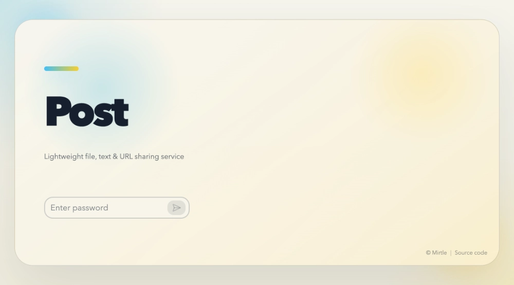
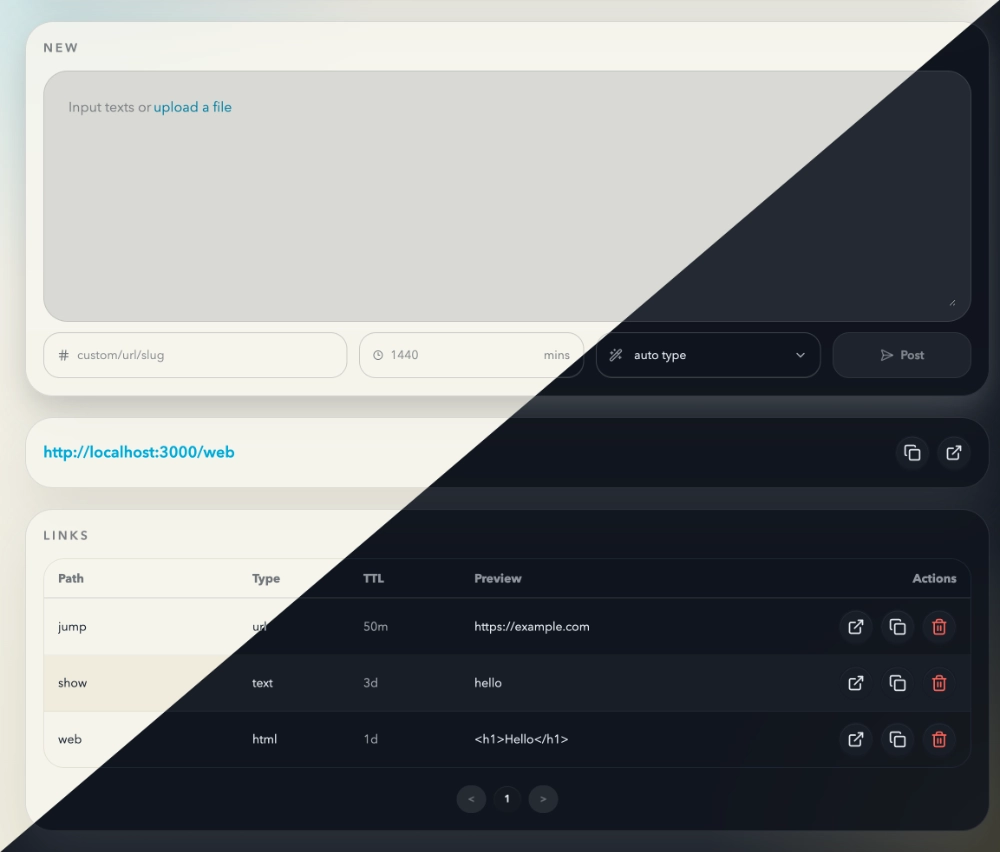

[Go version](https://github.com/mirtlecn/post-go)

# Post — Lightweight File, Text & URL Sharing API & Web UI

## Running

Prerequisites:
- Node.js 24+ / Vercel
- Redis (a valid Redis URL. Get a free one at <https://redis.com/>)
- S3-compatible storage (Required for file uploads)

```bash
# Install dependencies
npm install

# Build admin UI
npm run build

# Configure environment variables
cp .env.example .env.local

# Start local server (http://localhost:3000)
npm start

# Visit admin UI at <http://localhost:3000/admin>
```

Env:
- Required: `LINKS_REDIS_URL`, `SECRET_KEY`
- Optional: `ADMIN_KEY` (only for `/admin` GUI login; if missing, GUI login falls back to `SECRET_KEY`)
- Optional: `MAX_CONTENT_SIZE_KB` (default 500), `MAX_FILE_SIZE_MB` (default 10), `S3_ENDPOINT`, `S3_ACCESS_KEY_ID`, `S3_SECRET_ACCESS_KEY`, `S3_BUCKET_NAME`, `S3_REGION`

## Web UI

Available at <http://localhost:3000/admin>. Password is `SECRET_KEY` or `ADMIN_KEY` if set.



## HTTP API

Write operations require the header `Authorization: Bearer <SECRET_KEY>`.

Suggested shell variables:

```bash
export POST_BASE_URL="https://example.com"
export POST_TOKEN="your-secret-key"
```

```bash
# Create a short URL or text snippet with JSON.
# `type` can be omitted for normal URLs, or set to `text` / `html`.
curl "$POST_BASE_URL" \
  -X POST \
  -H "Authorization: Bearer $POST_TOKEN" \
  -H "Content-Type: application/json" \
  -d '{
    "url": "https://target.com",
    "path": "mylink",
    "ttl": 1440
  }'

# Create rendered HTML from Markdown on write.
curl "$POST_BASE_URL" \
  -X POST \
  -H "Authorization: Bearer $POST_TOKEN" \
  -H "Content-Type: application/json" \
  -d '{
    "url": "# Title\n\nHello from Markdown",
    "path": "doc/readme",
    "convert": "md2html"
  }'

# Upload a file to S3-compatible storage.
curl "$POST_BASE_URL" \
  -X POST \
  -H "Authorization: Bearer $POST_TOKEN" \
  -F "file=@./photo.jpg" \
  -F "path=uploads/photo"

# Update an existing entry with PUT.
curl "$POST_BASE_URL" \
  -X PUT \
  -H "Authorization: Bearer $POST_TOKEN" \
  -H "Content-Type: application/json" \
  -d '{
    "url": "https://new-target.com",
    "path": "mylink"
  }'

# List all entries.
curl "$POST_BASE_URL" \
  -H "Authorization: Bearer $POST_TOKEN"

# Export full content instead of preview.
# Works for list, single-path lookup, create/update, and delete responses.
curl "$POST_BASE_URL" \
  -H "Authorization: Bearer $POST_TOKEN" \
  -H "x-export: true"

# Read one entry as JSON metadata.
curl "$POST_BASE_URL" \
  -X GET \
  -H "Authorization: Bearer $POST_TOKEN" \
  -H "Content-Type: application/json" \
  -d '{"path":"mylink"}'

# Read one entry as JSON metadata and export full content.
curl "$POST_BASE_URL" \
  -X GET \
  -H "Authorization: Bearer $POST_TOKEN" \
  -H "Content-Type: application/json" \
  -H "x-export: true" \
  -d '{"path":"mylink"}'

# Read publicly by path: URL entries redirect, text/html return directly, files stream.
curl -L "$POST_BASE_URL/mylink"

# Create and export full content in response.
curl "$POST_BASE_URL" \
  -X POST \
  -H "Authorization: Bearer $POST_TOKEN" \
  -H "Content-Type: application/json" \
  -H "x-export: true" \
  -d '{"url":"https://target.com","path":"mylink"}'

# Delete by path.
curl "$POST_BASE_URL" \
  -X DELETE \
  -H "Authorization: Bearer $POST_TOKEN" \
  -H "Content-Type: application/json" \
  -d '{"path":"mylink"}'

# Delete and export full content in response.
curl "$POST_BASE_URL" \
  -X DELETE \
  -H "Authorization: Bearer $POST_TOKEN" \
  -H "Content-Type: application/json" \
  -H "x-export: true" \
  -d '{"path":"mylink"}'
```

## CLI wrap for Shell

<https://github.com/mirtlecn/post-go/post-cli>

## SKILL for AI Agent

<https://github.com/mirtlecn/post-go/skills>

## License

© Mirtle

MIT License
